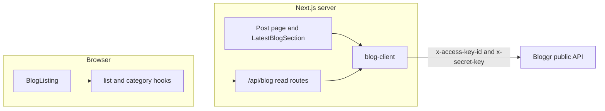

# Blog

The portfolio reads published posts from the [Bloggr public API](https://bloggr.io/docs). The browser never calls Bloggr and never sees the secret key.

Comments and likes are not part of this integration. The client does not call `/api/v1/comments` or the like endpoints, and `likes` on a post payload is dropped during mapping.

Dashboard key creation (`POST /api/v1/sites/.../api-keys`) is also out of scope. Keys are created in the Bloggr dashboard and stored as environment variables.

## Request flow



- The post page, homepage preview, and sitemap call `blog-client` directly from server components.
- Search, pagination, and the category filter run in the browser through hooks. Those hooks call same-origin route handlers, and the handlers call `blog-client`.
- `BlogArticle` does not fetch. The post page loads the post and passes it in. The article only uses `useReadingProgress` to update a local scroll bar.

Reads use `next: { revalidate: 3600 }`. The post page also exports `revalidate = 3600`.

The configured host is `https://dev-api.bloggr.io/api/v1`. The docs sample host `api.bloggr.com` is an example. Paths below are relative to that base, so a list request is `GET {BLOG_API_BASE_URL}/public/blogs`.

Bloggr resolves the workspace from the key pair. Requests do not send `site_id`.

If `BLOG_API_BASE_URL`, `BLOG_ACCESS_KEY_ID`, or `BLOG_SECRET_KEY` is missing, list and category calls return empty data and a slug lookup returns `null`. They do not throw.

## Environment

Defined on `env` in `src/lib/env.ts`. All three are server-only.

| Variable             | `env` field       | Role                     |
| -------------------- | ----------------- | ------------------------ |
| `BLOG_API_BASE_URL`  | `blogApiBaseUrl`  | Origin plus `/api/v1`    |
| `BLOG_ACCESS_KEY_ID` | `blogAccessKeyId` | `x-access-key-id` header |
| `BLOG_SECRET_KEY`    | `blogSecretKey`   | `x-secret-key` header    |

`isBlogConfigured()` is true only when all three are set. `assertBlogEnv()` throws if any of them is missing.

## Wire interfaces

These match Bloggr JSON. Only `src/lib/blog/blog.mapper.ts` and `src/lib/blog/blog-client.ts` should read them.

```ts
export interface BloggrErrorInterface {
  code: string;
  details?: string;
}

export interface BloggrEnvelopeInterface<T> {
  success: boolean;
  message: string;
  data: T;
  error?: BloggrErrorInterface;
}

export interface BlogAuthorWireInterface {
  name: string;
  email?: string;
}

export interface BlogCategoryWireInterface {
  _id: string;
  name: string;
  slug?: string;
  parent?: string | { _id?: string } | null;
  parent_id?: string | null;
  children?: BlogCategoryWireInterface[];
}

export interface BlogPostWireInterface {
  _id: string;
  title: string;
  slug: string;
  excerpt?: string;
  content?: string;
  featured_image?: string;
  author?: BlogAuthorWireInterface | string;
  category?: string | BlogCategoryWireInterface;
  tags?: string[];
  likes?: number;
  views?: number;
  published_at?: string;
  created_at?: string;
  read_time?: number;
  readTime?: number;
}

export interface BlogListWireInterface {
  data?: BlogPostWireInterface[];
  pagination?: Partial<BlogPaginationInterface>;
}
```

`likes` is accepted on the wire type so the payload type-checks, then discarded. It is not part of `BlogPostInterface`.

A successful envelope looks like `{ success, message, data }`. List calls nest another `data` array plus `pagination` inside that `data` field. A single post is the post object itself on `data`.

## Domain interfaces

Components, hooks, and route handlers use these types from `src/lib/blog/blog.types.ts`.

```ts
export interface BlogAuthorInterface {
  name: string;
  email?: string;
}

export interface BlogPostInterface {
  _id: string;
  title: string;
  slug: string;
  excerpt?: string;
  content?: string;
  featuredImage?: string;
  author?: BlogAuthorInterface;
  categoryId?: string;
  categoryName?: string;
  views?: number;
  publishedAt?: string;
  createdAt?: string;
  tags?: string[];
  readTime?: number;
}

export interface BlogPaginationInterface {
  page: number;
  limit: number;
  total: number;
  totalPages: number;
}

export interface BlogListResponseInterface {
  data: BlogPostInterface[];
  pagination: BlogPaginationInterface;
}

export interface BlogCategoryInterface {
  _id: string;
  name: string;
  slug?: string;
  parentId?: string;
  children?: BlogCategoryInterface[];
}

export interface BlogQueryParamsInterface {
  page?: number;
  limit?: number;
  search?: string;
  category?: string;
}
```

`category` on a wire post may be an id string or a populated category. The mapper stores the id on `categoryId` and the display name on `categoryName`. When the post only has an id, the client loads the category tree and fills the name from that map. The UI renders `categoryName` and does not show a raw id.

## Mapper

`src/lib/blog/blog.mapper.ts`

| Function            | Returns                     | Role                                              |
| ------------------- | --------------------------- | ------------------------------------------------- |
| `emptyBlogList`     | `BlogListResponseInterface` | Empty page used when credentials are missing      |
| `mapBlogCategory`   | `BlogCategoryInterface`     | One category, including nested `children`         |
| `mapBlogCategories` | `BlogCategoryInterface[]`   | A category array                                  |
| `flattenCategories` | `BlogCategoryInterface[]`   | Depth-first list for the filter and name lookup   |
| `categoryNameMap`   | `Map<string, string>`       | `_id` to name                                     |
| `mapBlogPost`       | `BlogPostInterface`         | Snake_case post to the domain post. Drops `likes` |
| `mapBlogList`       | `BlogListResponseInterface` | List payload plus category names                  |

`formatBlogDate` in `src/lib/blog/blog-format.ts` turns `publishedAt` into a short date. Invalid values become `undefined`.

## Server client

`src/lib/blog/blog-client.ts` is imported only from server components and route handlers. `blogFetch` sends the two auth headers, reads the envelope, and throws `BlogClientError` with the HTTP status when Bloggr rejects the call. `limit` is capped at 100. Page numbers below 1 become 1.

| Client function        | Bloggr path                                | Returns                       |
| ---------------------- | ------------------------------------------ | ----------------------------- |
| `fetchBlogs`           | `GET /public/blogs`                        | `BlogListResponseInterface`   |
| `fetchBlogBySlug`      | `GET /public/blogs/slug/:slug`             | `BlogPostInterface` or `null` |
| `fetchBlogById`        | `GET /public/blogs/:id`                    | `BlogPostInterface` or `null` |
| `fetchCategories`      | `GET /public/blogs/categories?tree=true`   | `BlogCategoryInterface[]`     |
| `fetchBlogsByCategory` | `GET /public/blogs/categories/:categoryId` | `BlogListResponseInterface`   |

`fetchBlogBySlug` and `fetchBlogById` return `null` on HTTP 404.

Query parameters for `fetchBlogs`: `page`, `limit`, `search`, `category`. `fetchBlogsByCategory` takes `page`, `limit`, and `search` because the category is the path segment.

## Route handlers

Each handler returns the domain type, not the raw envelope.

| Route                      | Handler                                | Client function   | Response                    |
| -------------------------- | -------------------------------------- | ----------------- | --------------------------- |
| `GET /api/blog`            | `src/app/api/blog/route.ts`            | `fetchBlogs`      | `BlogListResponseInterface` |
| `GET /api/blog/categories` | `src/app/api/blog/categories/route.ts` | `fetchCategories` | `BlogCategoryInterface[]`   |
| `GET /api/blog/[slug]`     | `src/app/api/blog/[slug]/route.ts`     | `fetchBlogBySlug` | `BlogPostInterface` or 404  |

The listing uses `GET /api/blog?category=` , which Bloggr supports on the public list. `fetchBlogsByCategory` remains available for a caller that wants the category path instead.

## Hooks

`src/lib/blog/blog.queries.ts` is a client module.

| Hook                                | Used by       | Behavior                                                                       |
| ----------------------------------- | ------------- | ------------------------------------------------------------------------------ |
| `useBlogPosts(params)`              | `BlogListing` | React Query against `GET /api/blog`. Returns `BlogListResponseInterface`       |
| `useBlogCategories()`               | `BlogListing` | React Query against `GET /api/blog/categories`. A failed response becomes `[]` |
| `useDebouncedValue(value, delayMs)` | `BlogListing` | Waits 500ms before search is sent                                              |
| `useReadingProgress(barId)`         | `BlogArticle` | Sets the width of `#reading-progress` from scroll position. No network call    |

## Components

```text
HomePage
  LatestBlogSection          server, fetchBlogs({ limit: 3 })
    BlogCard                 heading="h3"

BlogPage
  BlogListing                client
    useDebouncedValue
    useBlogPosts
    useBlogCategories
    BlogCard                 heading="h2"
    BlogCardSkeletonGrid

BlogPostPage                 server, fetchBlogBySlug
  BlogArticle                client, post passed as a prop
    useReadingProgress
```

### `BlogCard`

```ts
interface BlogCardProps {
  post: BlogPostInterface;
  heading?: "h2" | "h3";
}
```

One card for the listing and the homepage. It links to `/blog/{slug}` and shows the featured image, category name, title, excerpt, date, read time, and views when those fields exist.

### `BlogCardSkeletonGrid`

```ts
{ count?: number } // default 6
```

Placeholder grid while `useBlogPosts` is loading.

### `BlogListing`

Owns search text, selected category id, and page index. It does not call Bloggr. Category options come from `flattenCategories` so nested categories still appear in the select. Changing search or category resets the page to 1.

### `BlogArticle`

```ts
interface BlogArticleProps {
  post: BlogPostInterface;
}
```

Renders the author, date, read time, views, tags, featured image, and HTML sanitized with DOMPurify. There is no like button and no comment form.

### `LatestBlogSection`

Async server section mounted on the homepage after testimonials. A fetch failure renders the empty state instead of throwing. Missing credentials say Bloggr still needs to be configured. A configured workspace with no published posts says nothing is published yet.

## Pages

| Path           | Data                                                     |
| -------------- | -------------------------------------------------------- |
| `/`            | `LatestBlogSection` calls `fetchBlogs({ limit: 3 })`     |
| `/blog`        | `BlogListing` through the hooks above                    |
| `/blog/[slug]` | `fetchBlogBySlug` in the server page, then `BlogArticle` |

The slug page passes `author.name` into `getBlogPostingJsonLd`. The sitemap walks `fetchBlogs` at `limit` 100 and emits `/blog/{slug}` for each published post. A Bloggr failure leaves the rest of the sitemap intact.
